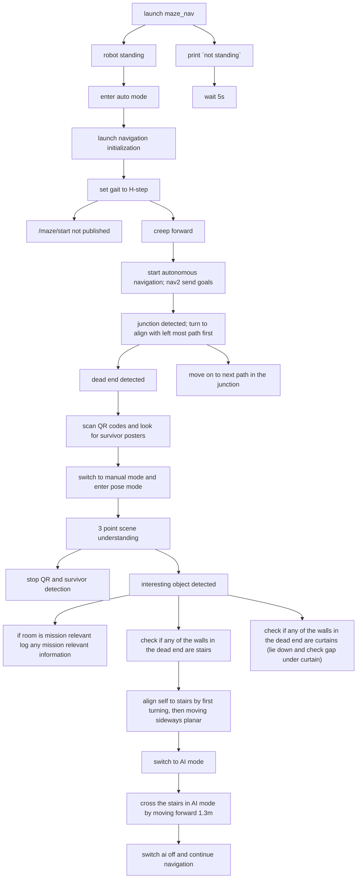

```mermaid
    flowchart TD
        start[launch maze_nav] -->stand[robot standing]
        stand-->auto[enter auto mode]
        start-->notStand[print `not standing`]
        notStand-->standWait[wait 5s]

        auto-->launch[launch navigation initialization]
        launch-->gait[set gait to H-step]
        gait-->notStart["/maze/start not published"]
        gait-->creep[creep forward]
        creep-->explore[start autonomous navigation; nav2 send goals]

        explore-->junction[junction detected; turn to align with left most path first]
        junction-->dend[dead end detected]
        junction-->nxtpath[move on to next path in the junction]
        dend-->percep[scan QR codes and look for survivor posters]
        percep-->pose[switch to manual mode and enter pose mode]
        pose-->scene["3 point scene understanding"]
        scene-->percepOff[stop QR and survivor detection]
        scene-->obj[interesting object detected]
        obj-->log[if room is mission relevant log any mission relevant information]
        obj-->stairs[check if any of the walls in the dead end are stairs]
        obj-->curtain["check if any of the walls in the dead end are curtains (lie down and check gap under curtain)"]

        stairs-->sAlign[align self to stairs by first turning, then moving sideways planar]
        sAlign-->ai[switch to AI mode]
        ai-->cross[cross the stairs in AI mode by moving forward 1.3m]
        cross-->nav[switch ai off and continue navigation]
```